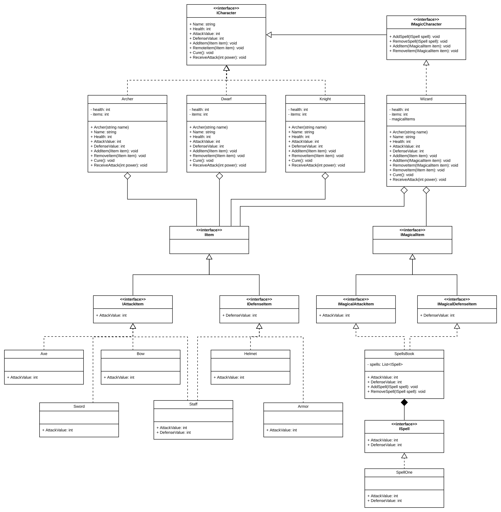

### FIT - Universidad Católica del Uruguay

 

# Encuentros de herederos en la Tierra Media

Los encuentros heredados en la Tierra Media no tienen nada que ver con personajes ancestrales que han pasado a mejor vida, sino con las similitudes que se pueden encontrar entre los componentes del juego. 

En el ejercicio anterior han encontrado algunas abstracciones útiles, pero como habrán visto, mucha de la lógica del juego se encuentra repetida en distintos objetos.

Si sólo existieran herramientas para reutilizar código...

# Desafío

## Parte 1: Refactoring

Refactorizen1 el código de la [parte 2](https://github.com/ucudal/PII_RoleplayGame_2_Start) para aplicar técnicas de reutilización de código que conozcan.

## Parte 2: Comprobar que sigue funcionando

Como bien saben, el proceso de refactoring cambia la estructura del código sin cambiar su comportamiento. Para demostrar esto, agreguen los casos de test de la parte 2 (o escribanlos si no llegaron a escribirlos o recibieron feedback para mejorarlos) y comprueben que todo siga funcionando igual que antes (los tests dan verde).

## Parte 3: Los malos (_The Bad Guys_)

Crearemos un nuevo tipo de personajes: los Enemigos (_Enemies_). 

Los **enemigos** son personajes (_characters_) que representan a "los malos". Los enemigos, al igual que los personajes que ya conocíamos, también tienen items para atacar y defender.

También le daremos una distinción a los personajes que ya conocíamos. A partir de ahora nos referiremos a ellos como los Héroes (_Heroes_).

Una diferencia entre los héroes y los enemigos es que los héroes acumulan puntos de victoria (VP), mientras que los enemigos _tienen_ un valor de puntos de victoria (VP). Cuando un héroe mata a un enemigo, el héroe gana los VP del enemigo que mató.

Cada integrante del equipo deberá agregar al menos un enemigo.

## Parte 4: Preparando el campo de batalla

Incorporaremos otro nuevo concepto a nuestro juego de encuentros en la Tierra Media: los Encuentros (_Encounters_).

Los **encuentros** son instancias donde **dos o más** personajes se encuentran para batallar (encuentros de combate). En el futuro incorporaremos otros tipos de encuentro. 

En un encuentro debe haber siempre personajes _Heroe_ y personajes _Enemigo_ (al menos uno de cada uno).

Todo encuentro deben exponer un método `void DoEncounter()` para ejecutarlo. Cuando el encuentro se ejecuta, los héroes batallarán contra los enemigos, de la siguiente forma:

- Los enemigos atacan primero. Cada enemigo ataca únicamente a un héroe. Si hay un sólo héroe, todos los enemigos atacan al mismo. Si hay más de un enemigo y más de un héroe, el primer enemigo ataca al primer héroe, el segundo enemigo ataca al segundo héroe, y así sucesivamente. Si hay menos héroes (N) que enemigos (M), el siguiente enemigo (N+1) ataca al primero héroe, el siguiente enemigo (N+2) ataca al segundo héroe, y así sucesivamente.

- Luego, los héroes sobrevivientes atacan a los enemigos. Todos los héroes atacan a cada uno de los enemigos 1 vez.

- Cada vez que un héroe mata a un enemigo, ese héroe se lleva los VP del enemigo que ha vencido.

- Se repite el primer punto.

El encuentro termina cuando todos los héroes o todos los enemigos han muerto. Si un héroe ha conseguido 5+ (5 o más) VP, se cura.

### 4.1: Tests

Identifiquen los tests necesarios para incorporar el concepto de encuentro y agreguenlos al proyecto de test. Estos tests deben fallar en este punto.

Incorporen los tests a la rama *master* del repositorio (utilizando Pull Requests), y creen un [_Tag_](https://git-scm.com/book/en/v2/Git-Basics-Tagging) en este commit llamado `TDD_Start`.

### 4.2: El código

Agreguen los encuentros y el código necesario para que funcionen según la lógica descrita anteriormente.

Al finalizar este paso, los tests del punto anterior (4.1) deben pasar (dan verde).

Incorporen el código a la rama *master* del repositorio (utilizando Pull Requests), y creen un [_Tag_](https://git-scm.com/book/en/v2/Git-Basics-Tagging) en este commit llamado `TDD_End`.

*******

## Anexo: Diagrama de clases

A continuación se incluye un diagrama de clases de la solución provista en src/

*******

1 _«La refactorización (del inglés refactoring) es una técnica de la ingeniería de software para reestructurar un código fuente, alterando su estructura interna sin cambiar su comportamiento externo.» [Fuente](https://es.wikipedia.org/wiki/Refactorizaci%C3%B3n)_. Aquí hay también una [guía de refactoring](https://refactoring.com/catalog/) muy útil. 